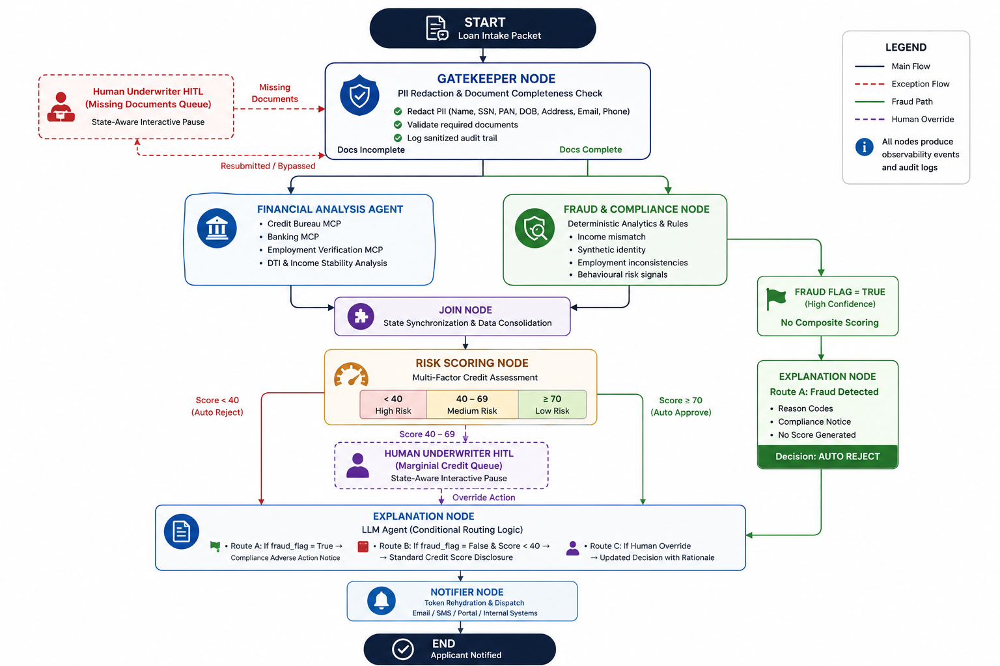
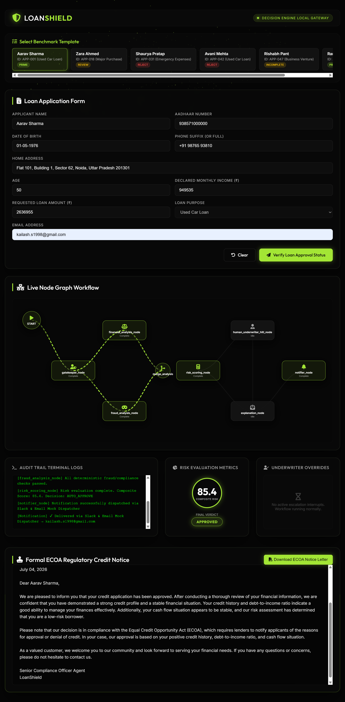
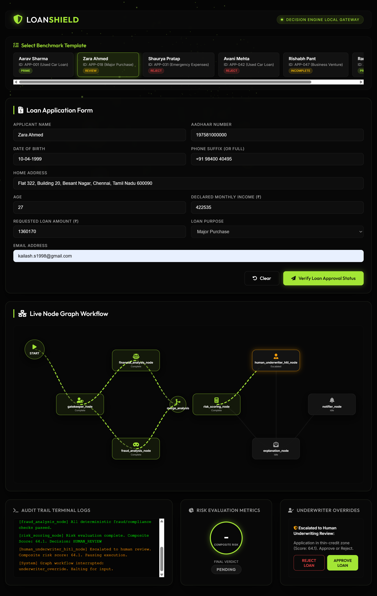
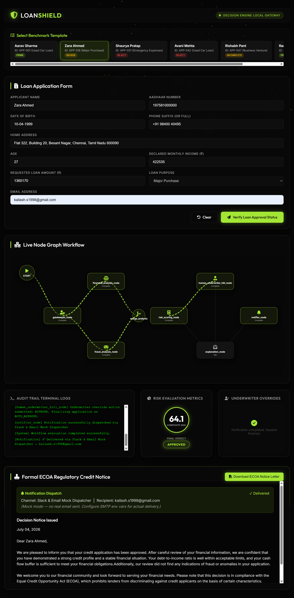
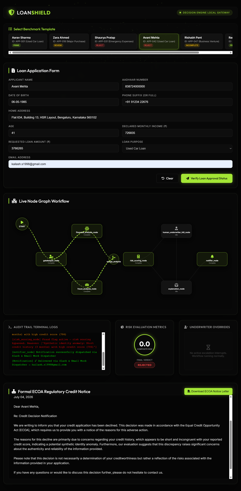
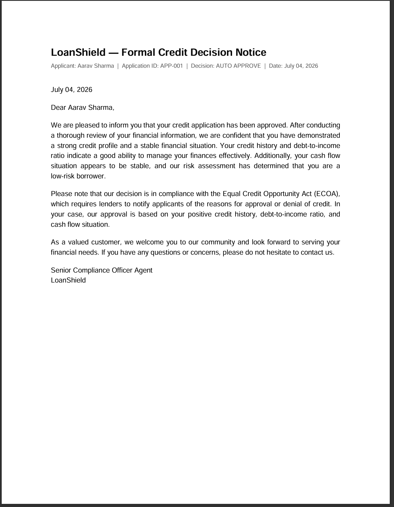
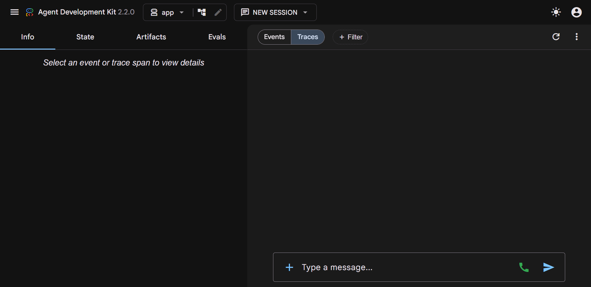
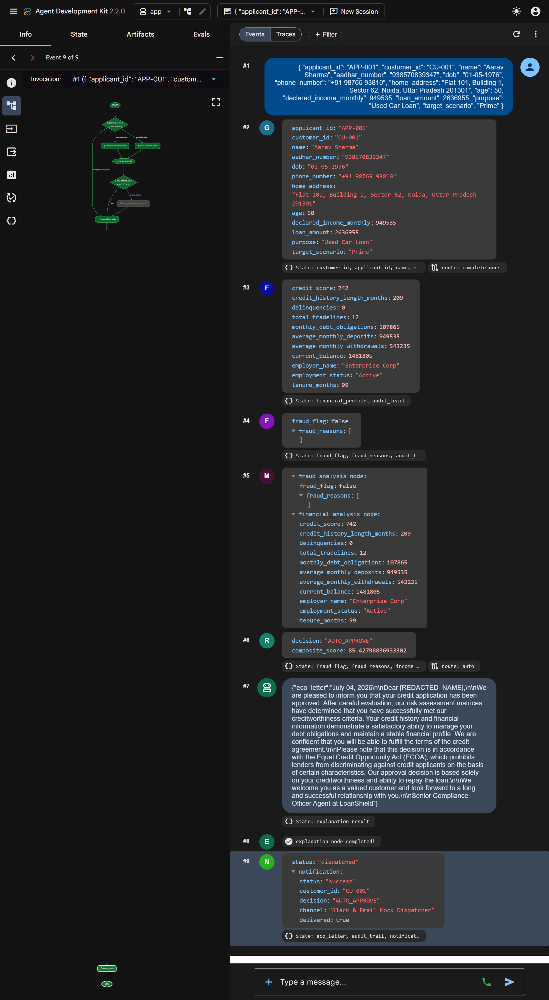
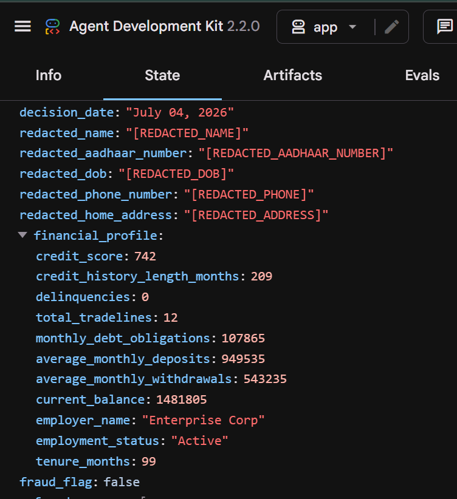

# LoanShield: A Multi-Agent Framework for Compliant, Real-Time Automated Lending Risk Analysis

LoanShield is an enterprise-grade automated lending decision platform built on Google's Agent Development Kit (ADK 2.0). It ingests credit applications, redacts sensitive PII, executes parallel financial analysis and compliance verification using stdio Model Context Protocol (MCP) servers, calculates a multi-factor credit risk score, and dispatches regulatory ECOA-aligned explanation letters.

---

## 🏛️ System Architecture

The LoanShield processing pipeline is structured as a LangGraph state workflow:


---

## 🤝 Multi-Agent Core Framework

LoanShield implements a structured multi-agent cooperation architecture using Google ADK to distribute responsibility across highly specialized agents:

1. **Orchestrator Agent (LangGraph Coordinator)**
   * **Role**: Governs the application lifecycle and execution state.
   * **Responsibilities**: Sequences intake triggers, coordinates parallel branch fan-out/fan-in processing (Financial + Fraud agents), resolves conditional routes, and manages HITL wait interrupts for underwriters.

2. **Gatekeeper Agent**
   * **Role**: Data intake, security sanitization, and document validation.
   * **Responsibilities**: Executes `pii_redactor_skill` to sanitize raw SSN, DOB, phone, and address into anonymized tokens. Queries the `document_storage_mcp_final.json` database. Pauses execution with an interrupt if documentation status is `INCOMPLETE`.

3. **Financial Analyst Agent**
   * **Role**: Financial profile check, verification of stated parameters, and affordability math.
   * **Responsibilities**: Invokes standard MCP server tools to query bank deposit lists, credit bureau indicators, and employment profiles. Executes the `income_verify_skill` to detect monthly deposit variances (flags >100% variance as fraud). Executes the `dti_calculator_skill` to score total monthly DTI debt obligations. Executes the `stability_modifier_skill` to compute the employment stability of the applicant.

4. **Fraud & Compliance Agent**
   * **Role**: Anti-fraud filters and circuit breakers.
   * **Responsibilities**: Enforces strict operational guardrails based on credit history and age limits:
     * *Synthetic Fraud Rule*: Catches anomalies where credit age < 6 months but credit score > 780.
     * *Income Mismatch Ratio*: Triggers if the applicant's self-reported income on the intake form is 2 times the verified income [deposits] found in banking deposit statements.
     * *Immaturity/High-exposure Rule*: Flags applicants under 21 requesting > $100,000.
     * *Employment Stable Income Check*: Screens for employment status = `Terminated`.
     * Instantly sets `fraud_flag = True` to bypass score calculations and trigger immediate rejection.

5. **Explanations Agent (Compliance Officer)**
   * **Role**: Regulatory adverse action notice compiler.
   * **Responsibilities**: Evaluates final node outcomes and builds credit decision notification letters using the `explanation_skill` LLM agent, aligning declines with Section 701(a) of the Equal Credit Opportunity Act (ECOA) (e.g. low FICO score, high DTI, fraud triggers) and masking all PII.

---

## 📁 Repository Structure

```
loanshield/
├── Makefile                        # Local dev commands (install, playground, test)
├── Dockerfile                      # Standardized container image definition
├── docker-compose.yml              # Multi-container orchestration configurations
├── pyproject.toml                  # Python package and dependency management (uv synced)
├── .github/workflows/              # CI/CD automated lint/test validation triggers
│   └── github_actions.yaml
├── datasets/                       # Reference mock datasets (JSON/CSVs)
├── app/
│   ├── __init__.py                 # Application initialization
│   ├── agent.py                    # LangGraph workflow coordination & agent nodes
│   ├── config.py                   # Environment variable mappings
│   ├── state.py                    # Graph state TypedDict and Pydantic schemas
│   ├── mcp_server.py               # Stdio MCP servers exposing databases as tools
│   └── skills/                     # Modular business verification functions
│       ├── pii_redactor.py         # Regex + LLM-based PII mask
│       ├── income_verify.py        # Plaid-style bank deposit validation
│       ├── dti_calculator.py       # Affordability DTI ratio checks
│       ├── stability_modifier.py   # Job tenure scoring adjustment
│       ├── risk_scoring.py         # Multi-factor score calculator
│       ├── fraud_detection.py      # Hard risk rules & limits
│       └── explanation.py          # ECOA regulatory notice builder
└── tests/
    ├── conftest.py                 # Global LLM mocks & patches (offline testing)
    ├── test_skills.py              # Unit tests for scoring/verification skills
    ├── test_mcp.py                 # Integration tests for MCP server tools
    └── test_graph.py               # End-to-end integration tests over all 54 rows
```

---

## 🚀 Local Development Commands

This project uses `uv` for dependency management. Access all tasks via the `Makefile`:

### 1. Installation
Install Python dependencies (either through make or requirements.txt) and run the app locally:
```bash
cd loanshield
make install
python -m app.custom_web_server
```

### 2. Playground Execution
Launch the local ADK web playground interface for manual underwriter checks:
```bash
make playground
```
*Access the interface locally at `http://127.0.0.1:18081`.*

___

## 📊 Decision Routing Grid

The LoanShield scoring engine generates risk scores ($0 - 100$) and routes system execution pathways using deterministic state machine constraints:

* **Auto-Approve** (Score $\ge 70$, zero fraud flags, all docs present): Applications are approved instantly.
* **Human Review / HITL Interruption** (Zero fraud flags): Suspends workflow execution context, initializing an asynchronous wait state for underwriter override validation under two scenarios:
    * **Marginal Credit Tier:** Score falls within the conditional window of $40 - 69$.
    * **Document Collection Exceptions:** Triggered immediately if mandatory documentation packets are marked missing—regardless of the baseline credit score metric.
* **Auto-Reject** (Score $< 40$ OR any fraud flag): Terminate processing pipeline instantly, lock credit exposure boundaries, and generate a regulatory ECOA-compliant adverse action explanation letter.

---

## 🖥️ Custom Web Application Portal

We built a custom, high-fidelity web gateway interface for LoanShield, replacing the generic command-line or basic forms with a state-of-the-art underwriting workstation:
1.  **3D WebGL Backdrop**: Utilizes **Three.js** to render a real-time, dot-matrix animated particle field that responds dynamically to pointer coordinates via parallax drift and features a slow breathing pulse.
2.  **Translucent Glassmorphism Panels**: Built with a sleek dark aesthetic (`#0A0A0A`) accented by neon green (`#A3E635`), utilizing glass panels with `backdrop-filter: blur(12px)`.
3.  **Live Node Graph Workflow**: Displays the exact LangGraph agent node layout connected by active, pulsing SVG bezier connection paths that light up in real-time.
4.  **EventSource (SSE) Streaming**: Connects directly to the backend memory runner to stream node state transitions (`running`, `paused`, `completed`, `failed`) and transition logs.
5.  **Audit Trail Terminal Logs**: Simulates a CLI logs terminal directly on the page, with info/warning/critical color-coding.
6.  **Interactive Underwriter Overrides Box**: Pauses execution and pops up override control buttons (`APPROVE`, `REJECT`, `RESUME`) when human intervention is triggered.

---

## 📸 Web UI Execution Screenshots

---

### Scenario: Auto Approved

*This screenshot shows a prime credit application being successfully processed. The risk scorer evaluates the profile at a composite score of 85.4, resulting in a final verdict of **APPROVED** and drafting the congratulations approval notice.*

___

### Scenario: Human in the loop

*This screenshot illustrates the workflow paused at `human_underwriter_hitl_node` (pulsing orange). Because the risk score of 64.1 lies within the review threshold, the process suspends and displays interactive **APPROVE LOAN** and **REJECT LOAN** override buttons in the bottom-right panel.*



*This screenshot showcases the application state after the human underwriter clicks the **APPROVE LOAN** override button for Harper Robinson. The workflow resumes from its paused state, evaluates the final decision as **APPROVED**, and displays the completed audit trail logs.*

---

### Scenario : Auto Rejected

*This screenshot demonstrates the auto-rejection state for applicant. A synthetic fraud identity mismatch is flagged, resulting in a risk score being overridden to a **REJECTED** verdict. The formal ECOA Credit Notice letter details the specific adverse action reasons at the bottom.*

---

### ECOA Decision Notice Letter

*This screenshot shows the formal ECOA Credit Notice letter.*

---

## 🎮 Google ADK Developer Playground Walkthrough

For low-level tracing, debugging, and inspecting state changes between individual LangGraph nodes, you can execute the workflow inside the built-in **Google Agent Development Kit (ADK) Playground**:

### 1. ADK Playground Initialized

*The default, clean workspace interface of the Google ADK playground portal, loaded with the `app` configuration. From here, you can initiate new underwriting traces, inspect state histories, evaluate metrics, and send custom JSON application messages.*

---


### 2. ADK Playground Execution Completed

*This screenshot shows the complete, successfully resolved 14-step event trace history. You can inspect the final computed risk score (85.42), the automated approval routing edge transition, and the completed ECOA credit notice letter generated by the Explanations agent.*

*NOTE: Only in the **notifier_node**. PII redacted data is replaced by raw data. Throughout the workflow, PII redacted data is being referred. Refer to the following screenshot of state data captured in between the workflow execution*



